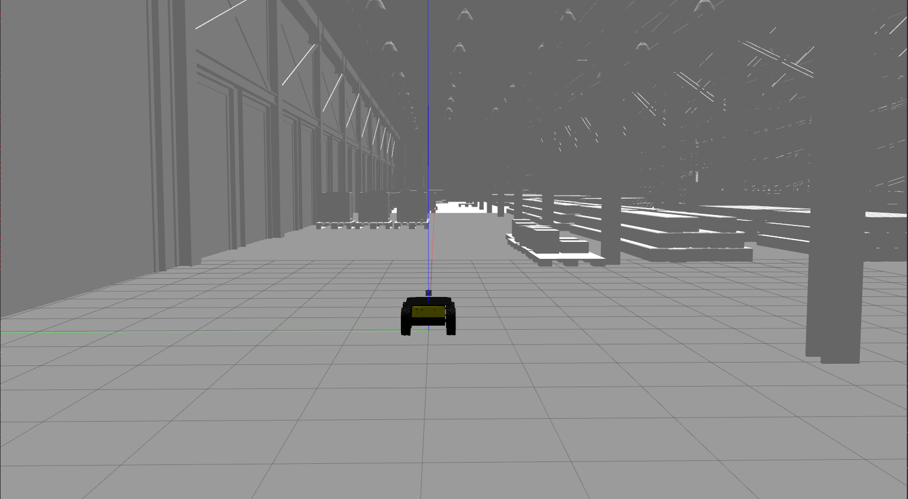
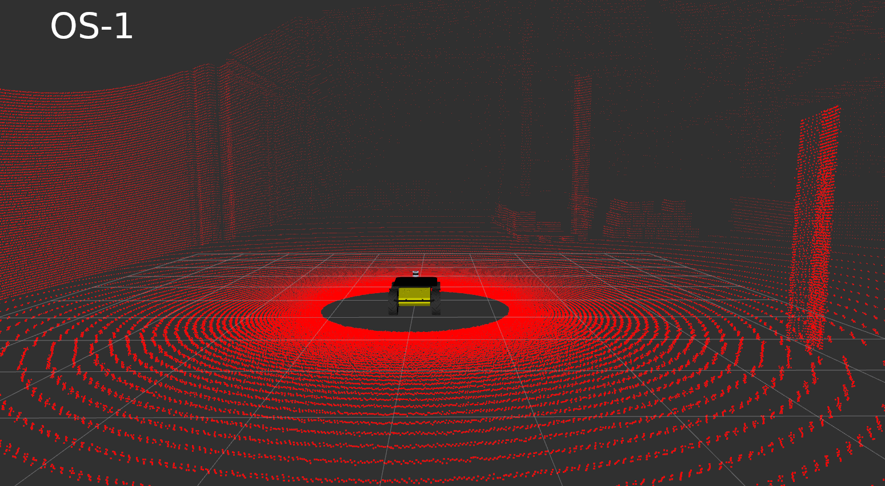
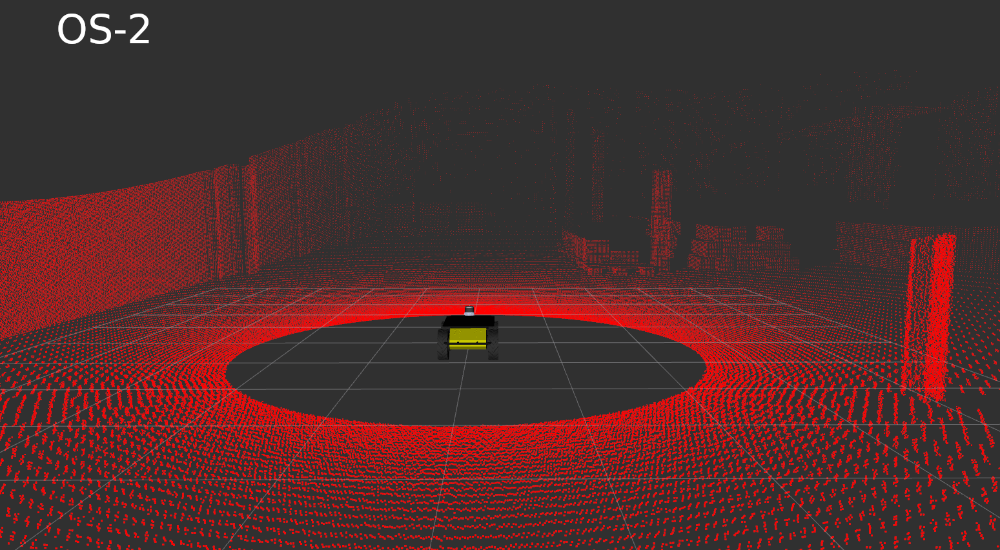
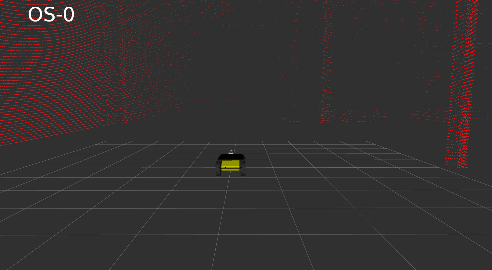
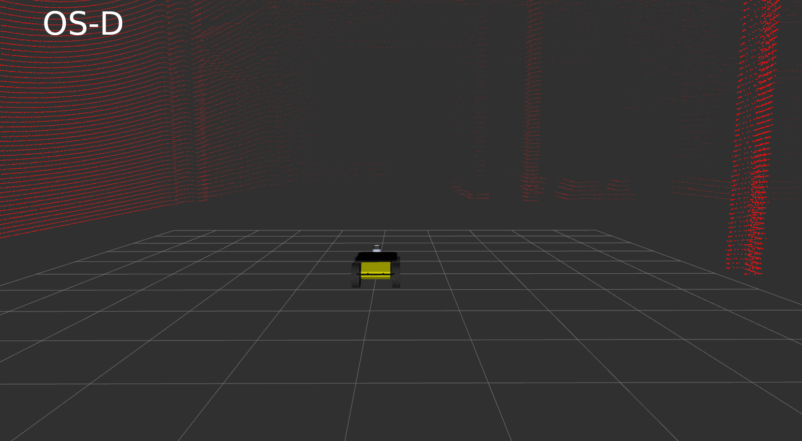

Simulation env. based on Clearpath's Husky -> [husky_customization](https://github.com/husky/husky_customization).

## Using PQM Simulator

- Install the husky simulator from [here](http://wiki.ros.org/Robots/Husky). The pqm version will not work if the required URDFs and controllers from base husky are not present
- Extract the models from the `worlds/pqm_models.zip` into the `~/.gazebo/models` folder. Make this folder if it doesn't exist
- Build and source this package
- Export env variables (see below) with the required sensors. For traditional applications use the OS-0 128 (env=12) channel LiDAR with no camera.
- To run the simulator, use the command  
    - Warehouse: `roslaunch husky_pqm pqm_warehouse.launch`
    - Mai City: `roslaunch husky_pqm pqm_mai.launch`

### Configuration ###
| Sensor | FOV |
| ------ | ------ |
| OS-0    | [-45, 45] |
| OS-1    | [-22.5, 22.5] |
| OS-2    | [-11.25,11,25] |

| Noise-Name | Value |
| ------ | ------ |
| N1 | 0.008 |
| N2 | 0.0113 |
| N3 | 0.016 |

Removed OS-D

 Env Variable | Sensor  | Beams | Noise    |
| ------------- | ------------- | ------------- | ------------- |
| 1  | OS-1 |  128 | 0.008
| 2  | OS-2 | 128 | 0.008
| 3  | OS-0 | 128 | 0.008
| 4 | OS-1 |  64 | 0.008
| 5  | OS-2 | 64 | 0.008
| 6  | OS-0 |  64 | 0.008
| 7  | OS-1 | 32 | 0.008
| 8  | OS-2 | 32 | 0.008
| 9  | OS-0 | 32 | 0.008
| 10  | OS-1 |  128 | 0.0113
| 11  | OS-2 | 128 | 0.0113
| 12  | OS-0 | 128 | 0.0113
| 13 | OS-1 |  64 | 0.0113
| 14  | OS-2 | 64 | 0.0113
| 15  | OS-0 |  64 | 0.0113
| 16 | OS-1 | 32 | 0.0113
| 17 | OS-2 | 32 | 0.0113
| 18  | OS-0 | 32 | 0.0113
| 19  | OS-1 |  128 | 0.016
| 20  | OS-2 | 128 | 0.016
| 21  | OS-0 | 128 | 0.016
| 22 | OS-1 |  64 | 0.016
| 23  | OS-2 | 64 | 0.016
| 24  | OS-0 |  64 | 0.016
| 25 | OS-1 | 32 | 0.016
| 26 | OS-2 | 32 | 0.016
| 27  | OS-0 | 32 | 0.016

Disable Camera and LiDAR using `export HUSKY_BLACKFLY=0` `export HUSKY_OUSTER=0`
 

<!---->

<!-- husky
=====

Common ROS packages for the Clearpath Husky, useable for both simulation and
real robot operation.

 - husky_control : Control configuration
 - husky_description : Robot description (URDF)
 - husky_msgs : Message definitions
 - husky_navigation : Navigation configurations and demos

For Husky instructions and tutorials, please see [Robots/Husky](http://wiki.ros.org/Robots/Husky).

To create a custom Husky description or simulation, please fork [husky_customization](https://github.com/husky/husky_customization).

husky_desktop
=============

Desktop ROS packages for the Clearpath Husky, which may pull in graphical dependencies.

 - husky_viz : Visualization (rviz) configuration and bringup

For Husky instructions and tutorials, please see http://wiki.ros.org/Robots/Husky

husky_simulator
==============

Simulator ROS packages for the Clearpath Husky.

 - husky_pqm : Gazebo plugin definitions and extensions to the robot URDF.

For Husky instructions and tutorials, please see http://wiki.ros.org/Robots/Husky -->
