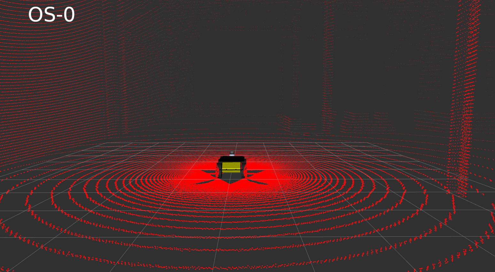

## Using PQM Simulator

- Extract the models from the `worlds/pqm_models.zip` into the `~/.gazebo/models` folder
- Build and source this package
- To run the simulator, use the command  
    - Warehouse: `roslaunch husky_pqm pqm_warehouse.launch`
    - Mai City: `roslaunch husky_pqm pqm_mai.launch`

### Configuration ###

| Sensor  | FOV | Env Variable |
| ------------- | ------------- | ------------- |
| Camera  | -  | `export HUSKY_BLACKFLY=1` | 
| OS-1  | [-22.5, 22.5]  | `export HUSKY_OUSTER=1` | 
| OS-2  | [-11.25, 11.25]  | `export HUSKY_OUSTER=2` |
| OS-0  | [-45, 45]  | `export HUSKY_OUSTER=3` |
| OS-D  | [0, 90]  | `export HUSKY_OUSTER=4` |

Disable Camera and LiDAR using `export HUSKY_BLACKFLY=0` `export HUSKY_OUSTER=0`
 

Simulation env. based on Clearpath's Husky -> [husky_customization](https://github.com/husky/husky_customization).

<!-- husky
=====

Common ROS packages for the Clearpath Husky, useable for both simulation and
real robot operation.

 - husky_control : Control configuration
 - husky_description : Robot description (URDF)
 - husky_msgs : Message definitions
 - husky_navigation : Navigation configurations and demos

For Husky instructions and tutorials, please see [Robots/Husky](http://wiki.ros.org/Robots/Husky).

To create a custom Husky description or simulation, please fork [husky_customization](https://github.com/husky/husky_customization).

husky_desktop
=============

Desktop ROS packages for the Clearpath Husky, which may pull in graphical dependencies.

 - husky_viz : Visualization (rviz) configuration and bringup

For Husky instructions and tutorials, please see http://wiki.ros.org/Robots/Husky

husky_simulator
==============

Simulator ROS packages for the Clearpath Husky.

 - husky_pqm : Gazebo plugin definitions and extensions to the robot URDF.

For Husky instructions and tutorials, please see http://wiki.ros.org/Robots/Husky -->
